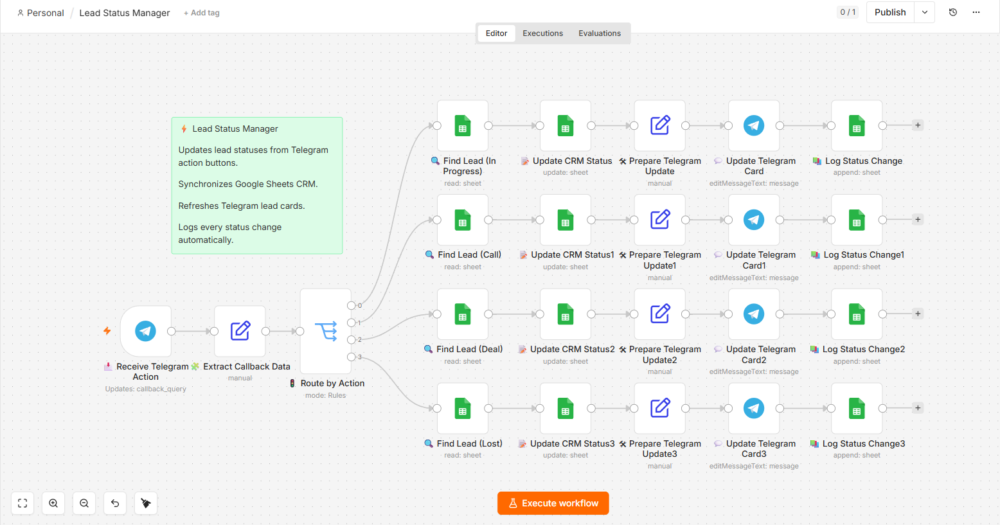
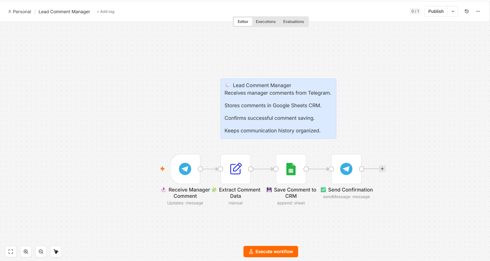
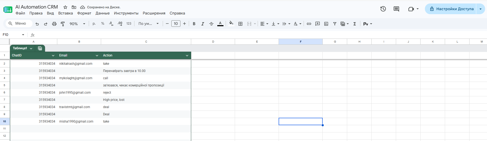

<div align="center">

# 🚀 AI Lead Collector

### AI-Powered Lead Qualification & CRM Automation with n8n


<br>


</div>

---

# 📌 About

**AI Lead Collector** is a complete AI-powered lead management system built with **n8n**.

The workflow automatically collects leads from **Google Forms**, analyzes them using **OpenAI**, stores them inside **Google Sheets CRM**, sends rich notifications to **Telegram**, allows sales managers to change lead status directly from Telegram, and saves manager comments into CRM automatically.

This project demonstrates how AI can automate an entire lead qualification pipeline with almost zero manual work.

---

# ✨ Features

- 📥 Automatic lead collection from Google Forms
- 🤖 AI-powered lead qualification
- 📊 Google Sheets CRM integration
- 📲 Telegram lead notifications
- 🔄 Telegram lead status management
- 💬 Telegram comment logging
- 📝 Automatic activity history
- ⚡ Fully automated workflow
- 🔧 Easy to customize and extend

---

# 🛠 Tech Stack

| Technology | Purpose |
|------------|---------|
| n8n | Workflow Automation |
| OpenAI API | AI Lead Qualification |
| Google Forms | Lead Collection |
| Google Sheets | CRM Storage |
| Telegram Bot API | Notifications & CRM Actions |

---

# 📊 Workflow

```text
Google Forms
      │
      ▼
Receive Lead
      │
      ▼
OpenAI Analysis
      │
      ▼
Lead Qualification
      │
      ▼
Google Sheets CRM
      │
      ▼
Telegram Notification
      │
      ▼
Manager Actions
(Status / Comments)
      │
      ▼
CRM Updated Automatically
```

---

# 📸 Screenshots

## 🤖 Main AI Lead Collector


Collects leads, analyzes them with AI, stores them in CRM and sends Telegram notifications.

---

## 🔄 Telegram Lead Status Manager



Processes Telegram action buttons, updates lead status in Google Sheets CRM, refreshes Telegram cards and stores activity history.

---

## 💬 Telegram Comment Manager



Receives manager comments from Telegram, saves them into CRM and confirms successful logging.

---

## 📊 Google Sheets CRM


Central CRM where every AI-qualified lead is stored.

---

## 📝 Manager Activity Log



Stores every manager action and comment received from Telegram.

---

## 📲 Telegram Lead Notification


Automatically generated AI lead card delivered to the sales team.

---

## ✅ Updated Telegram Card


Lead card automatically refreshed after manager interaction.

---

# 📁 Project Structure

```text
AI-Lead-Collector/
│
├── Banner.png
├── README.md
│
└── screenshots/
    ├── workflow.png
    ├── workflow1.png
    ├── workflow2.png
    ├── google-sheets.png
    ├── google-sheets1.png
    ├── telegram-message.png
    └── telegram-status-update.png
```

---

# 🚀 Project Overview

This repository showcases an AI-powered lead automation system built with **n8n**, **OpenAI**, **Google Forms**, **Google Sheets**, and **Telegram**.

The implementation demonstrates:

- AI-based lead qualification
- Automated CRM synchronization
- Telegram notifications and lead management
- Activity history tracking
- End-to-end no-code workflow automation

> **Note:**  
> This repository is intended for **portfolio and educational purposes**. Workflow files and API credentials are not included.

---

# 💼 Business Value

- Reduce manual lead processing
- AI-powered lead qualification
- Automatic CRM synchronization
- Telegram-based lead management
- One-click status updates
- Manager comment logging
- Complete lead activity history
- Faster sales response time

---

# 🎯 Use Cases

- AI Lead Qualification
- CRM Automation
- Sales Pipeline Automation
- Telegram CRM
- AI Workflows
- Marketing Automation
- Customer Management
- Business Process Automation

---

# 📄 License

This project is published for educational and portfolio purposes.

---

<div align="center">

### ⭐ If you like this project, give it a star!

</div>
