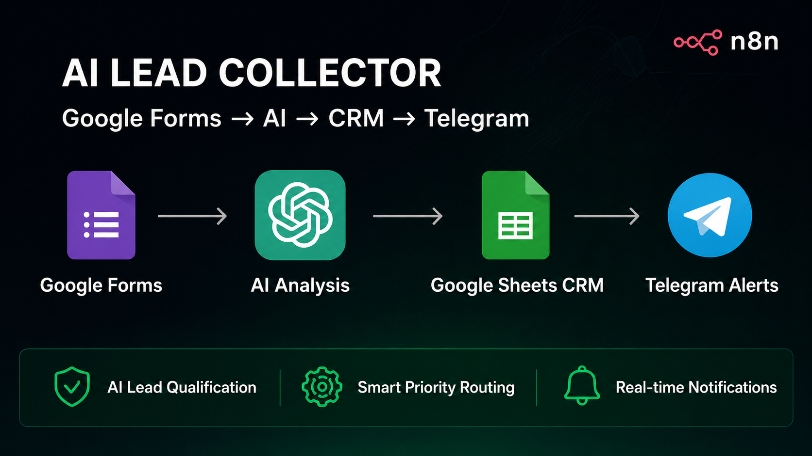
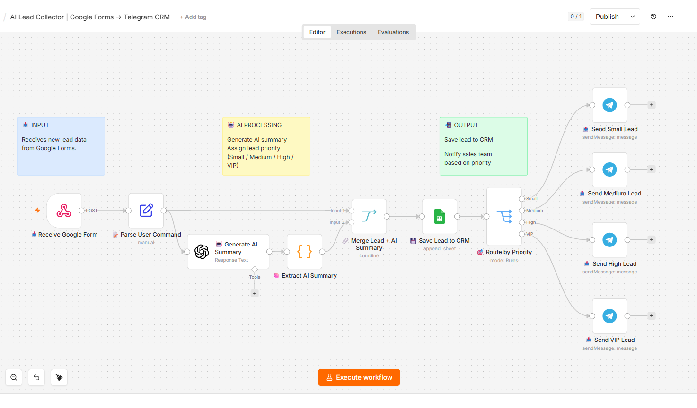
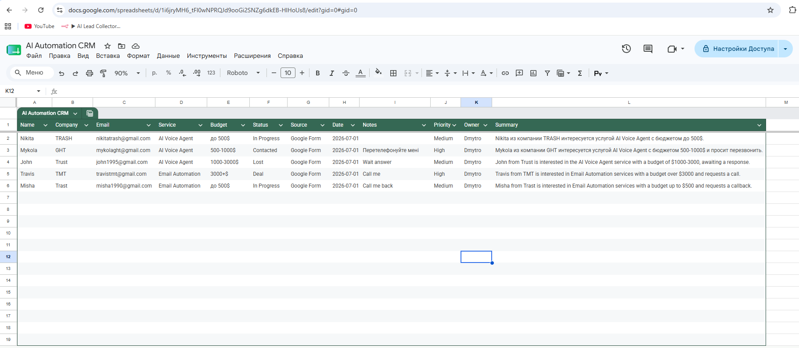
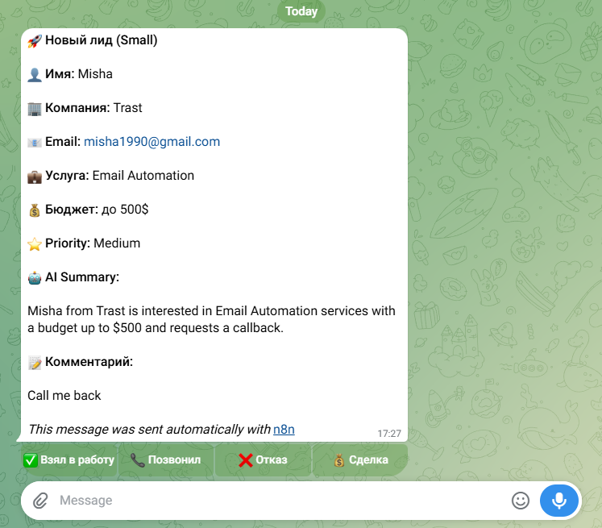
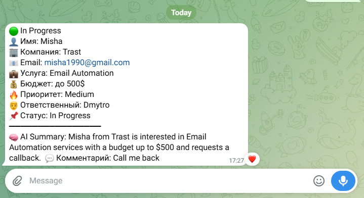

<div align="center">

# 🚀 AI Lead Collector

### AI-Powered Lead Qualification & Automation with n8n



<br>


</div>

---

# 📌 About

**AI Lead Collector** is an automated lead qualification system built with **n8n**.

The workflow collects customer requests from **Google Forms**, analyzes them using **OpenAI**, stores all information in **Google Sheets**, and instantly sends notifications to **Telegram**.

This project demonstrates how AI can automate repetitive business processes, reduce manual work, and improve response speed.

---

# ✨ Features

- 📥 Automatic lead collection from Google Forms
- 🤖 AI-powered lead qualification
- 📊 Google Sheets CRM integration
- 📲 Instant Telegram notifications
- ⚡ Fully automated workflow
- 🔄 Easy to customize and extend

---

# 🛠 Tech Stack

| Technology | Purpose |
|------------|---------|
| n8n | Workflow Automation |
| OpenAI API | AI Lead Qualification |
| Google Forms | Lead Collection |
| Google Sheets | CRM Storage |
| Telegram Bot API | Notifications |

---

# 📊 Workflow

```text
Google Forms
      │
      ▼
Receive New Lead
      │
      ▼
OpenAI Analysis
      │
      ▼
Lead Qualification
      │
      ▼
Google Sheets CRM
      │
      ▼
Telegram Notification
```

---

# 📸 Screenshots

## Workflow



---

## Google Sheets CRM



---

## Telegram Notification



---

## Updated Lead Status



---

# 📁 Project Structure

```text
AI-Lead-Collector/
│
├── Banner.png
├── README.md
│
├── workflows/
│   └── ai-lead-collector.json
│
└── screenshots/
    ├── workflow.png
    ├── google-sheets.png
    ├── telegram-message.png
    └── telegram-status-update.png
```

---

# 🚀 Getting Started

### 1. Clone the repository

```bash
git clone https://github.com/kalenukdmitriy-source/AI-Lead-Collector.git
```

### 2. Import the workflow

Open **n8n** and import the workflow from the **workflows** folder.

### 3. Configure credentials

Before running the workflow, configure:

- OpenAI API
- Google Forms
- Google Sheets
- Telegram Bot

### 4. Activate the workflow

Enable the workflow and submit a test form.

---

# 💼 Business Value

- Reduce manual lead processing
- Improve response time
- AI-powered lead qualification
- Automatic CRM updates
- Instant Telegram alerts
- Easy integration into existing business processes

---

# 🎯 Use Cases

- Lead Qualification
- CRM Automation
- Sales Automation
- AI Workflows
- Marketing Automation
- Business Process Automation

---

# 📄 License

This project is published for educational and portfolio purposes.

---

<div align="center">

### ⭐ If you like this project, give it a star!

</div>
